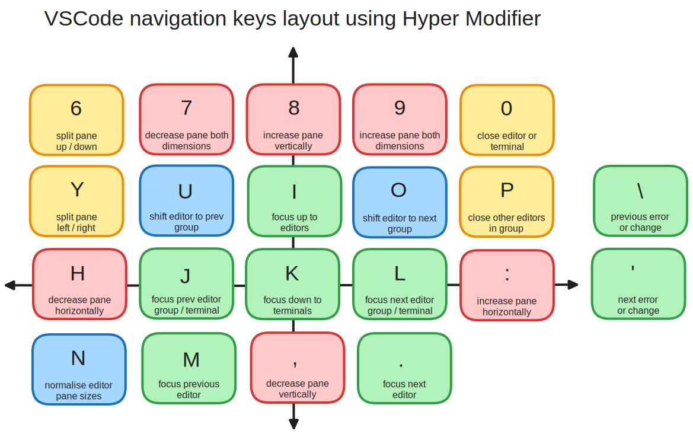
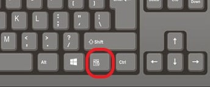
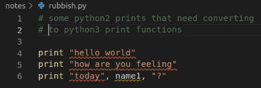

Work Faster in VSCode Without Needing a Mouse
=============================================

Introduction
------------

Every few years I have a go at learning to use my IDE without a mouse. I've
put hours of effort in and always failed. That is until I purchased a
[ZSA Voyager keyboard](https://www.zsa.io/voyager/) a couple of weeks ago.

In this post I'll explain how I have achieved this and provide details on how
you can do the same. Although I'm using the Voyager, these tips will work for
many keyboards, but you will get the best results with a keyboard that is:

- programmable, preferably with [QMK](https://qmk.fm/) or [ZMK](https://zmk.dev/)
- [ortholinear](https://www.howtogeek.com/70291/what-is-an-ortholinear-keyboard-and-should-you-use-one/)

Why the Voyager
---------------

There are a few things that the voyager brings that have helped achieve
(near) zero mouse use in VSCode.

- The compact, ortholinear layout lets you feel your way around easily,
  never have to stretch your fingers and never loose the home keys.
  Therefore you never need to look away from the monitor.
- The above means you are so comfortable that moving a hand to the mouse
  really feels like it is disrupting your flow.
- The ability to program a hyper key means that you can assign a bunch of
  vscode keybindings without constantly clashing with other keybindings.
- Finally, you can program the keyboard to operate as a mouse so that for minor
  mouse use where you have failed to bind or remember a function you can still
  keep your hands in place.

Hyper Key Bindings
------------------

Having a single key to press *ALL* the modifier keys simultaneously allows for
creating a set of keybindings that do not clash with any existing keybindings
in VSCode. There are so many keybindings that it has always been hard to create a
useful scheme without finding you have overridden an essential feature.

I have programmed a hyper key under the left thumb and then assigned all of the
right hand to features that navigate between panes and arrange panes in
VSCode. These IDE layout functions are the most common ones for which
the mouse is frequently used.

The ortholinear layout allows for a relatively intuitive placement of these
functions. Here is an image to help remember the placement:

The necessary vscode keybindings to go with this layout can be downloaded from
here:
[keybindings.json](https://github.com/gilesknap/zsa-voyager-vscode/blob/main/keybindings.json).
You should merge this file into
your user keybindings file. Use the menu command
`File > Preferences > Keyboard Shortcuts` to open your user keybindings.
These bindings are guaranteed not to clash with existing ones and
they don't delete any exiting bindings.

One problem with trying to memorize the default bindings is that there are
separate functions for similar operations. e.g. `next error` in a code editor
and `next change` in a Working Tree editor. Where possible I have used a
single keybinding to multiple similar functions, chosen by the context.

Other Useful Keys to Remember
-----------------------------

In order to complete the transition to mouse-free use, I created a list
of the remaining useful functions that have relatively accessible default
keybindings.

This section will not be useful for those that love Vim or some other non
default scheme. For someone who likes the defaults or who has never changed
them, like me, this list may come in handy. Memorizing these in combination
with the above hyper keys was enough to allow me to stop using a mouse.

## Keyboard Configuration

Some bindings below have multiple modifiers. These are good candidates
for programming into your keyboard. I have done this in my Voyager config,
for those combinations using `alt` `shift`.
See my voyager keyboard config
[here](https://configure.zsa.io/voyager/layouts/pDAzE/WOLZj/0)

It is a great idea to have the Application Key configured. This will give
you the context menu, equivalent to right mouse click on the currently
focused item.
On standard keyboards the application key looks like this:

## Breadcrumbs

This deserves its own heading as it is such a useful way to navigate all
the folders in your workspace and all the code sections within each file.

| Key | Action |
| --- | ------ |
| `ctrl shift` `.` | Focus breadcrumbs |
| `↓` `↑` `→` `←`| Navigate breadcrumbs |
| `space` | Open current file or jump to current section |

## Selection management - especially multi cursor

| Key | Action |
| --- | ------ |
| `alt shift` `→` | Expand selection |
| `alt shift` `←` | Shrink selection |
| `alt shift` `i` | add cursors to end of all selected lines (the 2 below can easily do cursors on start)
| `ctrl` `↓` | Add a cursor below |
| `ctrl` `↑` | Add a cursor above |
| `ctrl` `⏎` | Add all found words to selection |
| `ctrl` `d` | Add current word / next matching word to selection |
| `ctrl` `u` | undo last selection / cursor motion |

Example use of `ctrl` `d`:

## Navigating the Explorer

And other tree views like search results, git history, etc.

To get quick focus on these I suggest adding some more hyper keys, indeed the
keybindings.json linked above already has some. Or use ``Hyper`` ``I`` and then
a couple of ``Hyper`` ``J`` to focus on the Activity Bar (extreme left
list of icons), then select any of the explorer panes from there, using
`↓` `↑` and `enter`.

| Key | Action |
| --- | ------ |
| `↓` `↑` `→` `←`| Navigate (shift for multi-select) |
| `letter` | jump to next file starting with  letter |
| `shift letter` | jump to previous file starting with letter |
| `space` | open the current file in a preview editor, keep explorer focus |
| `enter` | open a file or all selected files in editors |
| `ctrl` `enter` | open current file in a new editor group to the right|
| `F2` | rename current file |
| `Application Key` | Context Menu - VERY useful!   |

## Navigating code

See Hyper Key Bindings above for navigating changes / errors.

| Key | Action |
| --- | ------ |
| `F12` | Jump to definition |
| `Application Key` | Menu for ALL code inspection options |
| `ctrl` `.` | Quick Fix - VERY useful! |
| `ctrl` `space` | Code completion suggestion |

## Terminals

See Hyper Key Bindings above for splitting and resizing terminals.

| Key | Action |
| --- | ------ |
| `ctrl shift`  `` ` `` | Open new terminal (back tick) |
| `ctrl page` `up`/`down` | Switch to prev / next Terminal Group |
| `ctrl` `↑` / `↓` | Scroll to previous / next command input |
| `ctrl shift` `↑` / `↓` | Move SELECTION to previous / next command output |
| `ctrl shift` `C` / `V` | Copy / Past SELECTION |

To get a terminal command output into an editor window:

- Select the one you want with ctrl arrows and ctrl shift arrows.
- `ctrl shift` `C` to copy
- `ctrl` `1` switch to fist editor group
- `ctrl` `n` for new window
- `ctrl` `v` to paste

Above is a good candidate for a keyboard macro if you have such a capability.

## Menus

| Key | Action |
| --- | ------ |
| `alt` | Show menu bar |
| `alt shift` `O` | Open Remotes / Dev Containers menu |

## Don't Forget

Every single command is available via the command palette `ctrl` `shift` `P`.
Its really useful for the obscure things like - clearing all the pop up
notifications, which has no default key binding. It's also great if you forget
a keybinding, as it will remind you of the binding once you find the command.

Summing Up
==========

Have I really stopped using the mouse altogether? Not quite, I certainly still
reach for it when switching to a browser. I also don't find the selection
of text in VSCode terminals that consistent.
It is almost brilliant, but falls a little short,
so that is now the only time I still use the mouse within VSCode.

On this final, successful attempt to eschew the mouse, I found I reached a
tipping point. I had got far enough that each time I got stuck, instead of
reaching for the mouse, I looked up and memorized a new shortcut, even outside
of VSCode. If you get to that point, you have cracked it!

This has been a huge change for me, my workflow feels significantly smoother and
faster, plus my RSI issues are fading fast.

I'm going to continue on this journey of keyboard skills improvement and you
can track updates to my notes
[here](https://github.com/gilesknap/zsa-voyager-vscode) if interested.

****

Giles Knap is a Software Engineer working for Diamond Light Source, the UK's
National Synchrotron.
